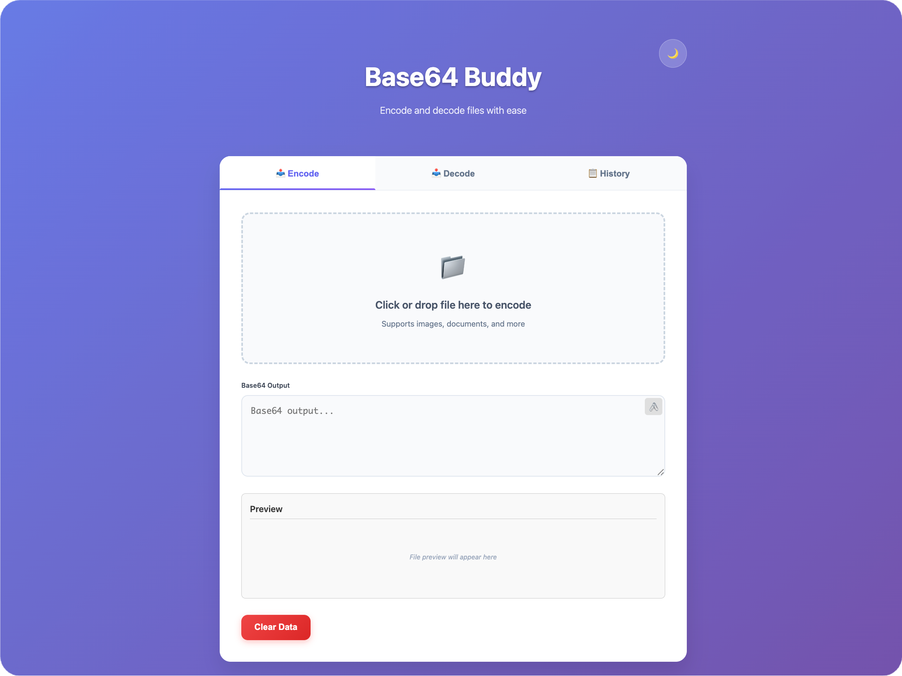
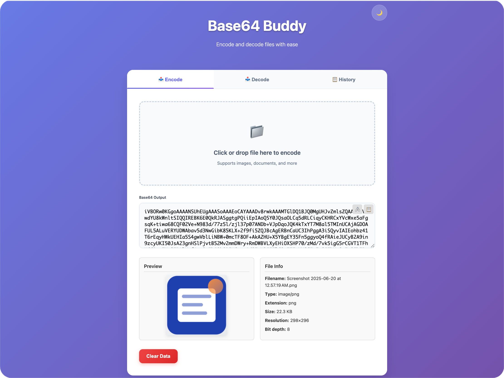
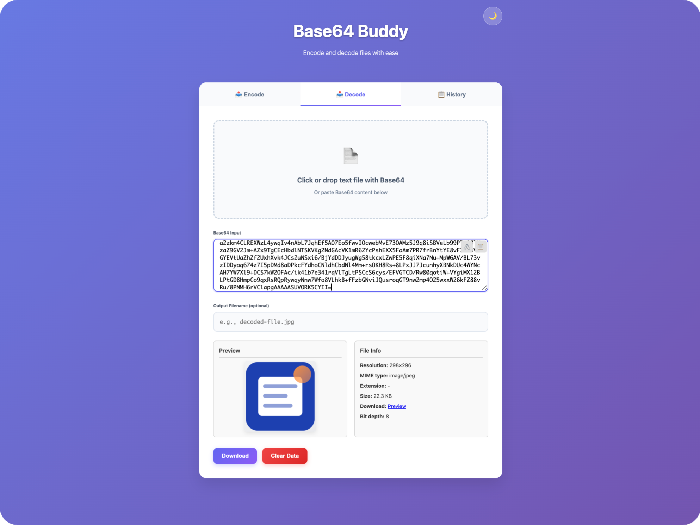
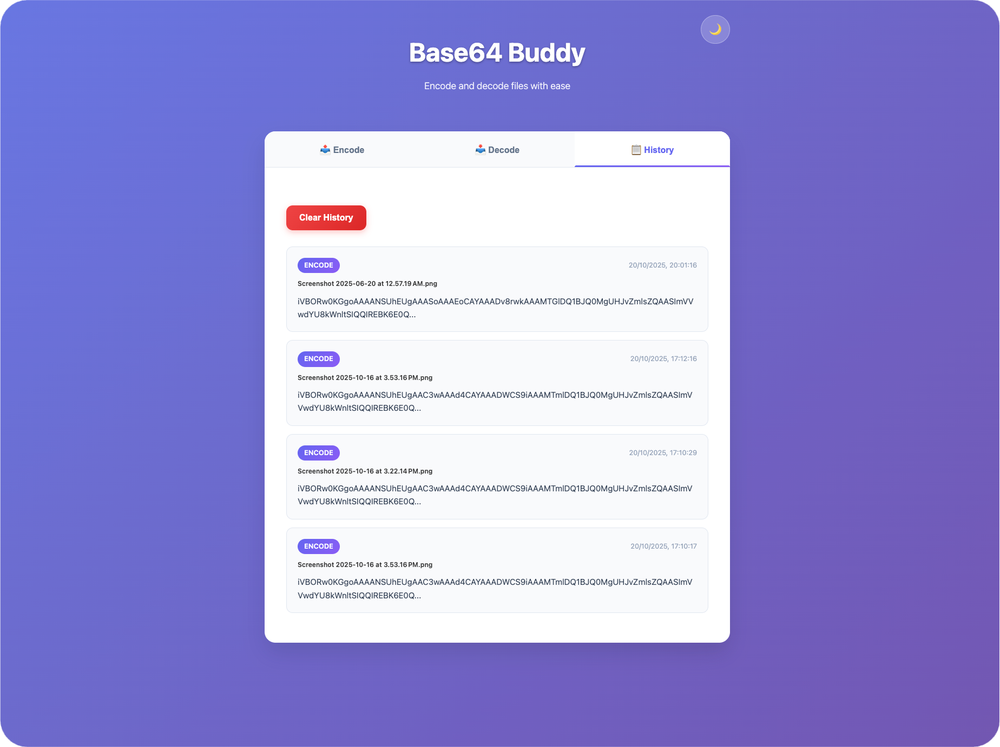
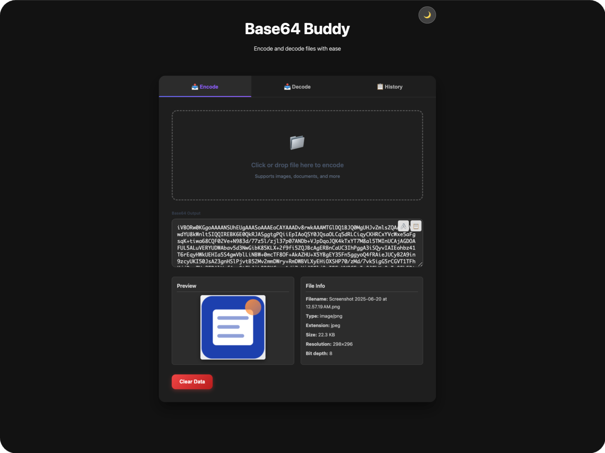

# 🧩 Base64 Buddy

[](https://opensource.org/licenses/MIT)   
[](https://github.com/Kartikpatkar/base64-buddy)   
[](https://chromewebstore.google.com/detail/base64-buddy/pbaojpkalnecabmgnkgdpfonmafpfphh)

> **Tagline:** _Encode. Decode. Simplify._

## ✨ Overview

**Base64 Buddy** is a modern, privacy-focused Chrome Extension that allows developers and designers to **encode and decode files into Base64 format** directly within the browser.  

Whether you’re working on web integrations, Salesforce configurations, or API payloads, Base64 Buddy simplifies the entire process with a clean, responsive, and developer-friendly interface.  

You can **upload files, preview them instantly, generate Base64 strings, decode existing data**, and even copy or clear results with a single click — all while staying fully offline.  

It’s built to be fast, intuitive, and visually consistent across devices, with features like:  
- Dual panels for encoding and decoding  
- Real-time image/file preview  
- Auto-generated file info (type, size, resolution)  
- URI toggling and copy-to-clipboard support  
- Dark/light theme with smooth UI transitions  
- Persistent history and preferences stored locally  

> 🚀 **Base64 Buddy** — your trusted companion for Base64 encoding and decoding, built for precision, performance, and privacy.

---

## 🚀 Features

### 🔹 Image & Text Encoding
- Upload any image file (JPG, PNG, GIF, etc.) or enter text manually  
- Instantly convert to Base64 format  
- Displays real-time **file details** (name, size, type, dimensions)  
- Responsive **image preview** with correct aspect ratio  
- Copy Base64 output with one click  
- Clear data option to reset everything cleanly

### 🔹 Image & Text Decoding
- Paste Base64 string or upload `.txt` files containing encoded data  
- Auto-detects and decodes Base64 into image or text  
- Displays decoded **image preview and metadata**  
- Error handling and visual toasts for invalid data  
- Clear data option to start fresh

### 🔹 Smart UI/UX
- Fully **mobile responsive** preview and layout  
- Intuitive tab switching for Encode / Decode modes  
- Real-time toast notifications for user feedback  
- Modern dark-themed interface  
- Detailed footer with author info and social links

---

## 📸 Screenshots

> Real screenshots from the live Chrome Extension

### 🔷 Light Mode






### 🌑 Dark Mode



---

## 🛠 Built With

| Layer | Technology |
|--------|-------------|
| **Frontend** | HTML5, CSS3, JavaScript (ES6 Modules) |
| **Design** | Custom CSS, Flexbox, Grid, Mobile Responsive Layout |
| **Storage** | `localStorage` (for history retention) |
| **Icons** | Font Awesome |

---

## 📦 Installation

### ✅ Option 1: [Chrome Web Store](#)

You can install **Base64 Buddy** directly from the Chrome Web Store:

👉 [Install from Chrome Web Store](https://chromewebstore.google.com/detail/base64-buddy/pbaojpkalnecabmgnkgdpfonmafpfphh)

Once installed:
- Click the extension icon in your browser 

> ✅ No login or setup required. Works 100% offline.

### 🔧 Option 2: Load Base64 Buddy Manually in Chrome

Until it's available in the Chrome Web Store, you can load SLDS Icons Kit manually for development or testing:

1. **Clone or Download this Repository:**

   ```bash
   git clone https://github.com/Kartikpatkar/base64-buddy
   ```

   Or download the ZIP from GitHub and extract it.

2. **Open Chrome and go to the Extensions page:**

   ```
   chrome://extensions/
   ```

3. **Enable Developer Mode:**

   Toggle the **Developer mode** switch in the top right corner.

4. **Click "Load unpacked":**

   - Select the root folder of the project (the one containing `manifest.json`).

5. **Done!**

   - You’ll now see Base64 Buddy in your extensions bar.
   - Click the icon to launch and start generating Apex!

---

## 🤝 Contributing

Contributions, issues, and feature requests are welcome!  
Feel free to fork the repository and submit pull requests.

Please adhere to the [Code of Conduct](CODE_OF_CONDUCT.md) and review [CONTRIBUTING.md](CONTRIBUTING.md) for guidelines.

---

## 🧠 Author Info

Built by **Kartik Patkar**  
🔗 [GitHub](https://github.com/Kartikpatkar) • [LinkedIn](https://linkedin.com/in/kartik-patkar) • [Trailhead](https://www.salesforce.com/trailblazer/kpatkar1)

---

## 📜 License

MIT License – free to use, modify, and distribute.

---

> Built for Salesforce developers, by Salesforce developers.  
> Icon Kit helps you make better Salesforce Components, faster!
